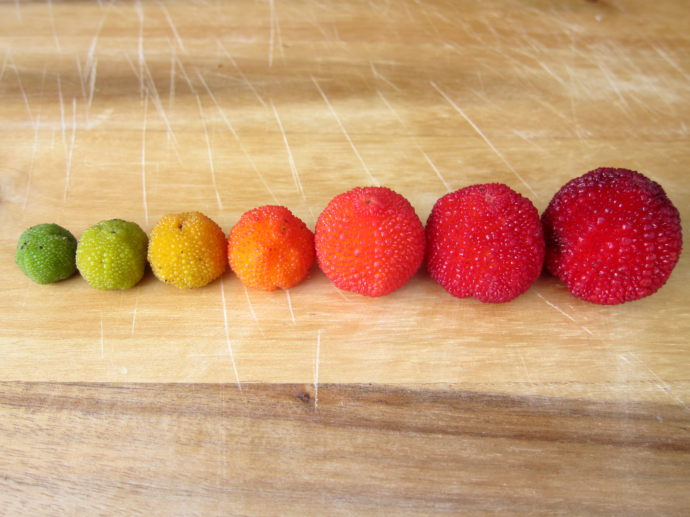
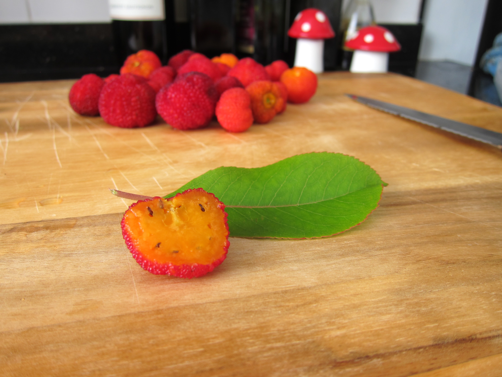
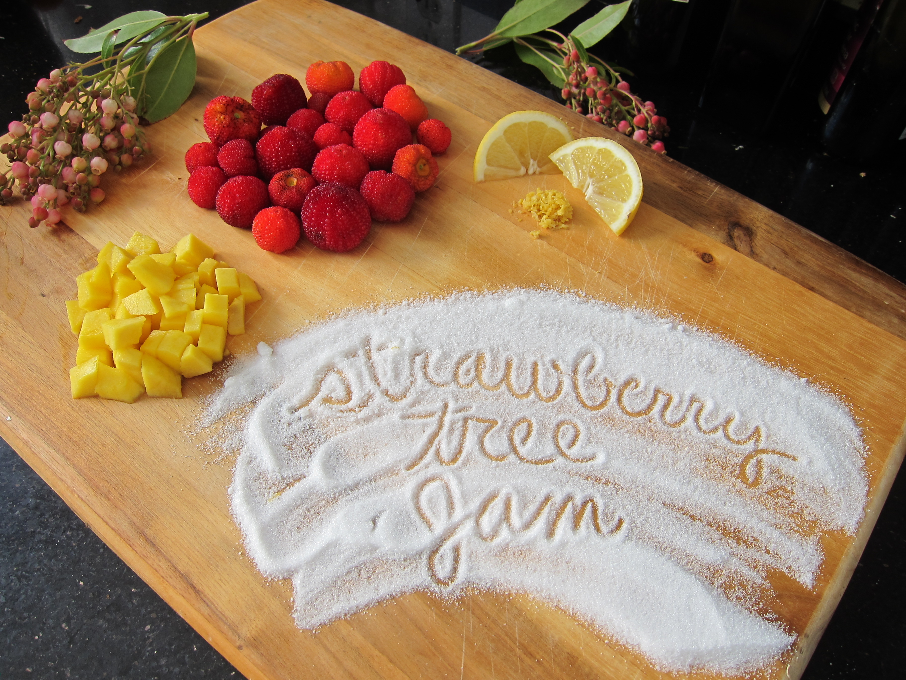

Title: Foraging the City: Strawberry Tree Jam
Date: 2014-05-27
Author: Fonda Tong
Slug: strawberry-tree-mango-jam
Category: food
Tags: recipes, strawberry trees, foraging

Hey! Let me tell you about the Strawberry Tree.

The Strawberry Tree, *Arbutus unedo*, bears edible fruit that resembles a cross between a cherry and a [yellow-bellied toad](http://en.wikipedia.org/wiki/Yellow-bellied_toad).

The tree has characteristic deep red papery bark which peels away in thin sheets. The leaves of the *Arbutus unedo* are a glossy deep green with a serrated edge. The flowers are bell shaped and range from white to light pink.


The fruit itself ranges from a light green (unripe) to dark red (ripe). The skin of the fruit is rough and bumpy. When unripe, the fruit are rock hard and astringent. However, when ripe, the fruits are mildly sweet and bear a texture that resemble an overripe peach.



The inside of a ripe Strawberry Tree fruit is amber colored and contains a multitude of teeny sesame shaped seeds. The fruit of a Strawberry Tree can be eaten raw, but the texture can be a bit off putting to some. The best applications of the fruit are in jams (which we will do in this post), wines, and pies.



Sounds great, right? But where can the Strawberry Tree be found? You've probably never encountered this fruit in the supermarket, but if you live in a region with Mediterranean climates it probably grows all around you. Many cities plant the *Arbutus unedo* as an ornamental tree, so if you do a bit of foraging you can make this jam for nearly free.


All of this fruit was harvested within a few blocks of our house!

There's a great website called [Falling Fruit](http://fallingfruit.org/) that provides an interactive map of urban fruit trees around your area. The data comes partially from pre-existing datasets provided by cities, universities, and other institutions; however, users can also contribute information. It's a bit like [iNaturalist](http://www.inaturalist.org/), but for the urban forager.

Anyone who is new (or old) to urban foraging should also check out Green Deane's website [Eat The Weeds](http://www.eattheweeds.com/). Green Deane is a Central Florida based educator and foraging buff.

Now, on to the recipe!



The recipe that I created is a modified version of [Green Deane's](http://www.eattheweeds.com/the-strawberry-tree-curse-2/). With the decreased sugar content and the addition of lemon juice and zest, the flavor of the jam is fruity and a bit tart. The addition of mango is optional. I had some on hand, so I thought that the added flavor would be welcome. Additional flavor elements that might work well are orange, cardamom, or cinnamon.


After cooking and straining the jam, the texture becomes velvety smooth. [[Tom](#)] and I ate it over vanilla bean ice cream. It was delicious! We also have plans for making *Arbutus unedo* iced green tea. However, you can always enjoy it simply on a piece of toast with lots of butter.


**Strawberry Tree Jam with Mango and Lemon**

[See notes at bottom of recipe]
```
Ingredients:
600g *Arbutus unedo*, Strawberry Tree, fruit
250g Water
150g Sugar
70g  Mango
     Zest of One Lemon
     Juice of One Lemon

Equipment:
Large Heavy Bottomed Pot
Glass Jars
Medium Saucepan
Mesh Sieve or Nut Milk Bag
Wooden Spoon
```
After washing your fruit put a large pot of water on to boil. This will be used to clean your jars. Once the water comes to a boil, place in your jars and lids in for at least 15 minutes. It's good practice to leave the jars in the hot water until you are ready to put your finished product in.

Cut your *Arbutus unedo* fruit into halves and dice your mango. Then place the fruit into the saucepan with the water. Simmer over medium-low heat until the fruit is soft and mashable. If need be add more water. The mixture should be thick, but not dry.

Let the fruit pulp cool down a bit and pass through a sieve using a wooden spoon. You want to mash the fruit along the sides of the sieve to help the fruit go through.

Rinse out your saucepan and return the strained fruit to the pan. Place over low heat again and add your sugar, mango, lemon juice, and zest. Cook until thick.

Pour your jam into the hot jars, and place the lids on top of the jars but do not screw on. Once the jam has cooled down a bit, you can fully tighten the lids.

This jam will keep in the fridge for a couple of weeks. Enjoy!

**Notes:**

* Make sure you wash your fruit extremely well. Since [Tom] and I gathered the fruit from trees growing along the side of a residential road we wanted to minimize contaminants.

* The amount of fruit that I used for this recipe is based on the amount that we gathered. You can scale the recipe up or down to fit your needs. This amount of fruit yielded about 1.5 small glass jars.

* Since I did not have a sieve I strained the pulp little by little through a nut milk bag. It worked out quite well in the end.
